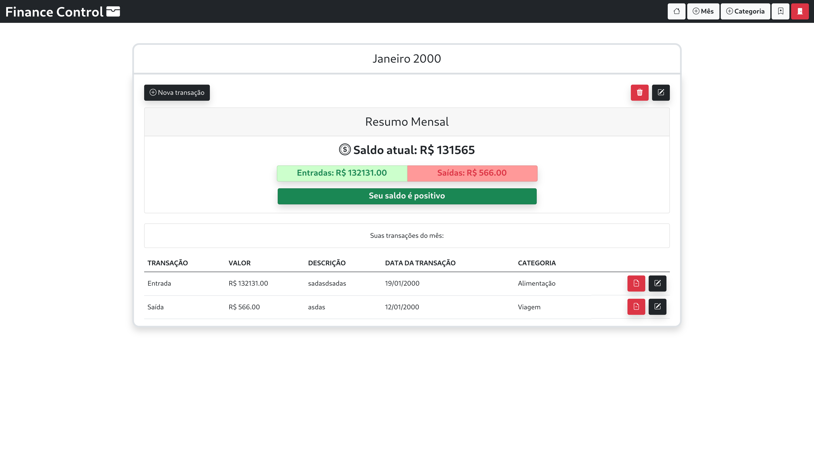
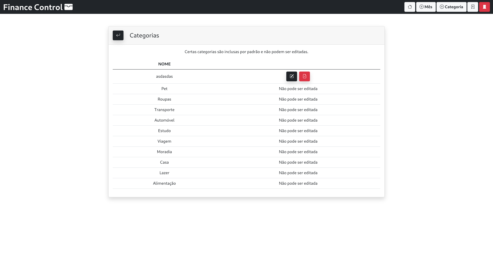

# Finance

Projeto desenvolvido para a disciplina de Desenvolvimento Web no Curso de Análise e Desenvolvimento de Sistemas, na Universidade de Marília.

[Vídeo de apresentação](https://youtu.be/qn37fBianlw).

## Integrantes

| Nome                        | RA      |
| --------------------------- | ------- |
| Matheus Gomes Pedroza       | 1998912 |
| Pablo Targa de Souza Vaz    | 2006536 |
| Pedro Henrique Alves Veloso | 2000140 |
| Rodrigo Bassalobre Garcia   | 2007642 |

## Sobre

O Finance é um gerenciador de financias pessoais, com opções para adição de categorias de gastos e ganhos, adição de meses de gastos e de transações (entrada ou saída) em determinados meses.

Esse projeto foi criado utilizando PHP, HTML, Bootstrap e MySQL.

## Como utilizar

Para rodar o projeto em sua máquina, tenha o XAMPP instalado e configurado corretamente.

Dentro da pasta `htdocs` do XAMPP, clone o projeto:

```bash
λ git clone https://github.com/pedrohaveloso/finance.git
```

Dentro da pasta, você encontrará um arquivo chamado `database.sql`. Ele é o dump do banco de dados, rode-o em seu banco MySQL para criar o banco e as tabelas da aplicação.

Após isso, abra o projeto em seu editor de preferência, entre no arquivo `app/connection.php` e configure a conexão com o banco de dados de acordo com as suas configurações locais do XAMPP.

## Conhecendo o projeto

Clicando no link a frente, você pode acessar um vídeo apresentando o uso do projeto:
[vídeo de apresentação](https://youtu.be/qn37fBianlw).

O projeto possui as seguintes telas:

### Cadastro de usuário


### Entrada de usuário


### Tela inicial



### Cadastro de categoria


### Listagem de categorias



### Cadastro de mês


### Cadastro de transação


## Estrutura do projeto

Todos os arquivos na pasta `components/*` são componentes visuais utilizados em diversas páginas, como a navbar.

Todos os arquivos contido na raiz do projeto são páginas visuais acessadas pelo usuário no navegador, as ações do projeto (como o POST de um formulário) estão em arquivos .php na pasta `actions/*`.

Dentro da pasta `app/*`, temos o arquivo de conexão com o banco, um arquivo de constantes globais do projeto e um arquivo `bootstrap.php`, onde nós concentramos todos os include's e a regra de validação de sessão do usuário. Esse arquivo é incluído em todas as demais páginas/ações.
